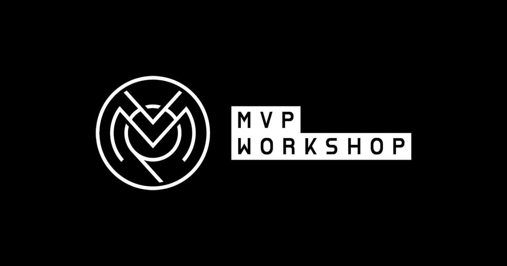

# MVP Staking dApp


---

## Overview
- This project implements a simple **staking smart contract** where users can stake ETH and receive **MVP tokens** (ERC20) in USD value.  
- The MVP token is minted on stake and burned on withdraw. The staking logic relies on a **Chainlink Price Feed** to convert ETH → USD.
  
---


## 📂 Contracts

- **MVPToken.sol**  
  ERC20 token with `mint` and `burn` restricted to contract owner (the staking contract).

- **MvpStaking.sol**  
  Staking contract:
  - Users stake ETH for a minimum of 180 days.  
  - Receives ETH, mints MVP tokens in USD equivalent.  
  - After staking period, user can withdraw ETH back and MVP tokens are burned.  
  - Uses Chainlink `AggregatorV3Interface` for price conversion.

- **PriceConverter.sol**  
  Library for ETH → USD conversion using Chainlink price feeds.

- **MockV3Aggregator.sol**  
  Local mock for Chainlink price feeds (useful for local Hardhat testing).

---

## ⚙️ Requirements

- Node.js `>=18` (LTS recommended; avoid Node 23+ for Hardhat issues)
- Yarn package manager
- Hardhat

---

## 📦 Installation

Clone and install dependencies:

```bash
git clone <repo_url>
cd mvpworkshop-stake
yarn install
````

---

## 🛠️ Compile & Test

Compile contracts:

```bash
yarn hardhat compile
```

Run unit tests:

```bash
yarn hardhat test
```

---

## 🚀 Local Deployment (Hardhat node)

Start a local Hardhat blockchain:

```bash
yarn hardhat node
```

In a separate terminal, deploy contracts to localhost:

```bash
yarn hardhat run scripts/Stake.ts --network hardhat
```

This script will:

1. Deploy `MockV3Aggregator` with `2000 USD / ETH`.
2. Deploy `MVPToken`.
3. Deploy `MvpStaking` with mock feed + token.
4. Transfer token ownership to staking contract.

---

## 🌐 Testnet Deployment (Sepolia example)

Update `hardhat.config.ts`:

```ts
networks: {
  sepolia: {
    url: process.env.SEPOLIA_RPC_URL || "",
    accounts: [process.env.PRIVATE_KEY || ""],
  },
},
etherscan: {
  apiKey: process.env.ETHERSCAN_API_KEY,
},
```

Deploy:

```bash
yarn hardhat run scripts/deploy.ts --network sepolia
```

Verify automatically runs inside script.

Alternatively, run manually:

```bash
yarn hardhat verify --network sepolia <DEPLOYED_ADDRESS> <PRICE_FEED> <MVP_TOKEN_ADDRESS>
```

---

## 🔑 Environment Variables

Create a `.env` file in root:

```bash
SEPOLIA_RPC_URL=https://eth-sepolia.g.alchemy.com/v2/<API_KEY>
PRIVATE_KEY=0xabc123...
ETHERSCAN_API_KEY=your_etherscan_key
```

---

## 🧾 Tests

All tests are written in TypeScript with Hardhat/Chai.
Run:

```bash
yarn hardhat test
```

Covers:

* Reverts if no ETH sent
* Reverts if staking period too short
* Proper mint of MVP tokens
* Prevent withdraw before staking period
* Withdraw returns ETH and burns MVP
* Multiple stakes update info
* Edge case: unsuccessful ETH transfer

---
